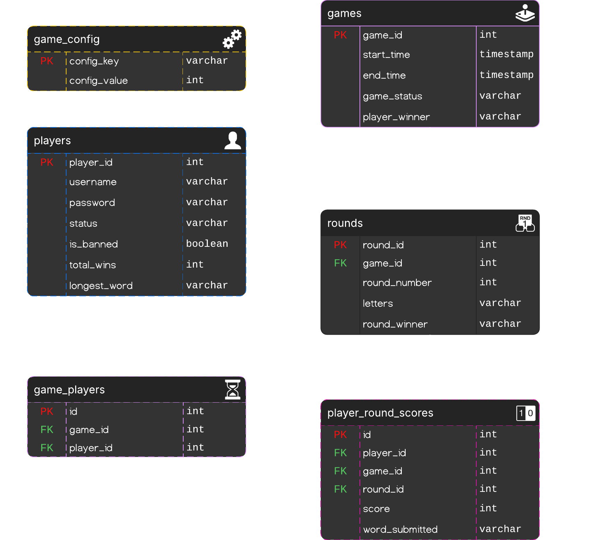
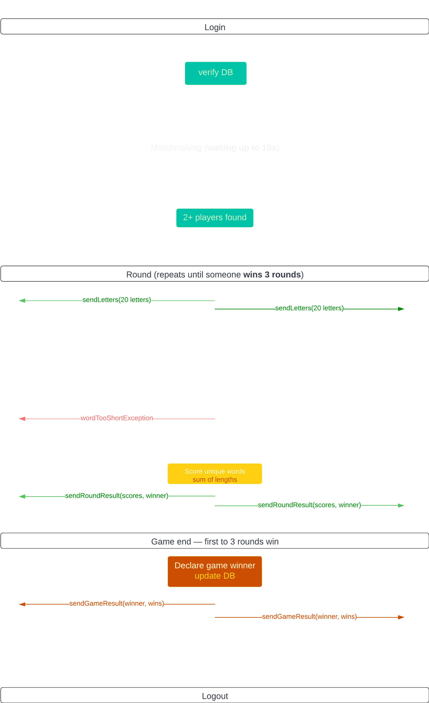

# Cypher👁‍🗨

## Programmer: [Anthony I. Tagorda](https://github.com/anthonytagorda)

### Overview

Cypher is a Word Factory Game that challenges players to decode and create words in a sleek, interactive environment.

## Technology Stack

- **Programming Language:** Java 8
- **Architecture:** Common Object Broker Architecture (CORBA)
- **Database:** MySQL
- **GUI Framework:** Java Swing

## ERD Diagram

## Sequence Diagram

## Modules

- **Player/s**: Allows players to log in, start games, submit words, and interact with the game interface.
- **Server/Admin**: Manages game sessions, validates players, handles game logic, and provides administrative
  functionalities.

## Directory Structure

- `client/`: Contains the client-side code for players to interact with the game.
- `server/`: Contains the server-side code for game management and administration.

## Getting Started

### To get started with the project:

1. Clone this repository to your local machine.
2. Set up your Java development environment (JDK 8 or higher) and ensure Maven is installed.
3. Install mysql-connector from https://dev.mysql.com/downloads/connector/j/
4. Have a list of words and placed in a ( words.txt ) file
5. Setup an .idl file
6. Configure and set up the MySQL database according to the provided database schema (`cypher.sql`).
7. Follow the instructions in the `player/` and `server/` directories to set up and run each component.

#### In the command line interface (CLI) issue the commands below:

**_**Click Alt + F12**_**

1. `idlj -fall cypher.idl`(run once or everytime you change the .idl file)
    * This generates:
        * Stubs (client-side proxies)
        * Skeletons (server-side base classes)
        * Helper/Holder classes for complex types
2. `tnameserv -ORBInitialPort [port number]`
3. `start orbd –ORBInitialPort 10050 –ORBInitialHost [localhost]`
4. `start java Server –ORBInitialPort 10050 –ORBInitialHost [localhost]`
5. `start java Client –ORBInitialPort 10050 –ORBInitialHost [localhost]`

## Contributions

Contributions are welcome! Please fork the repository and submit a pull request.

## License

This project has no license.
